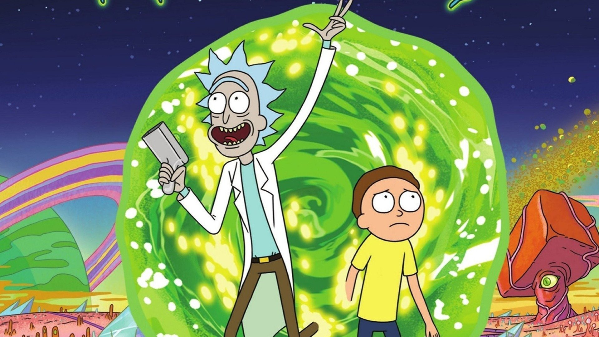
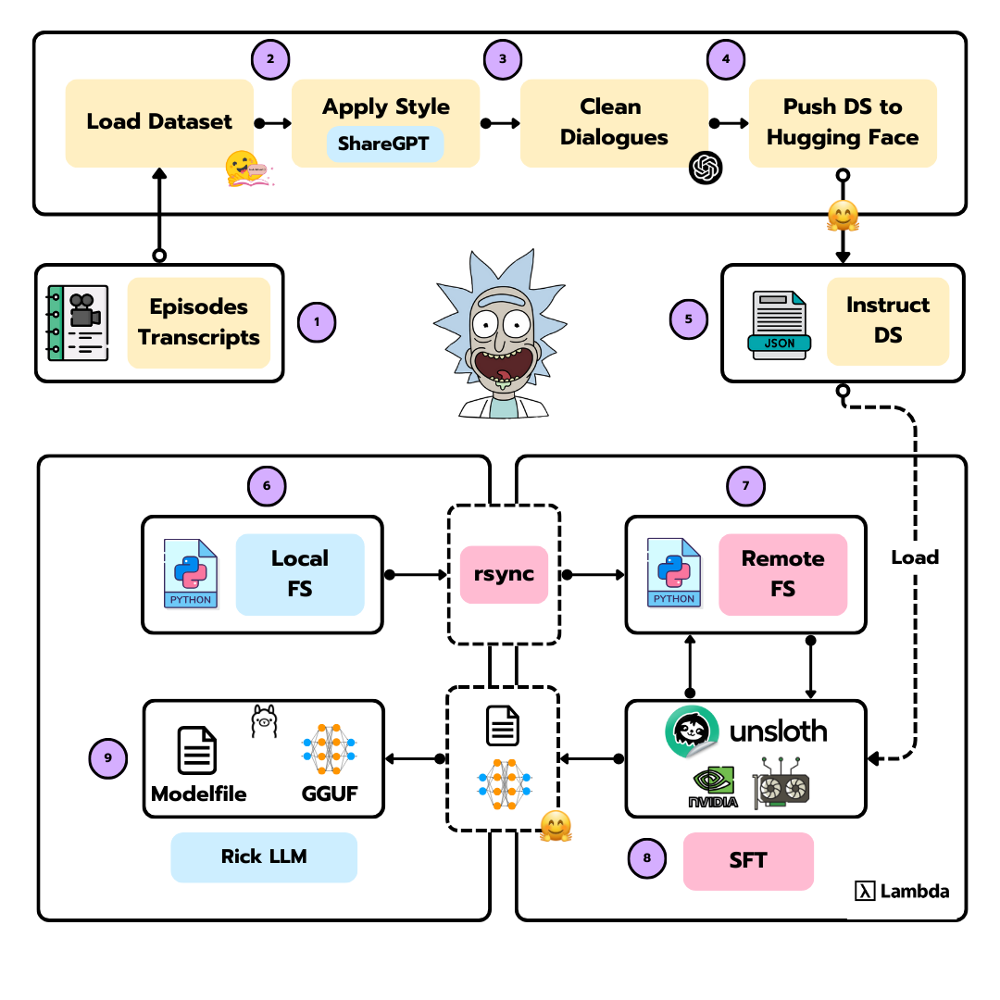
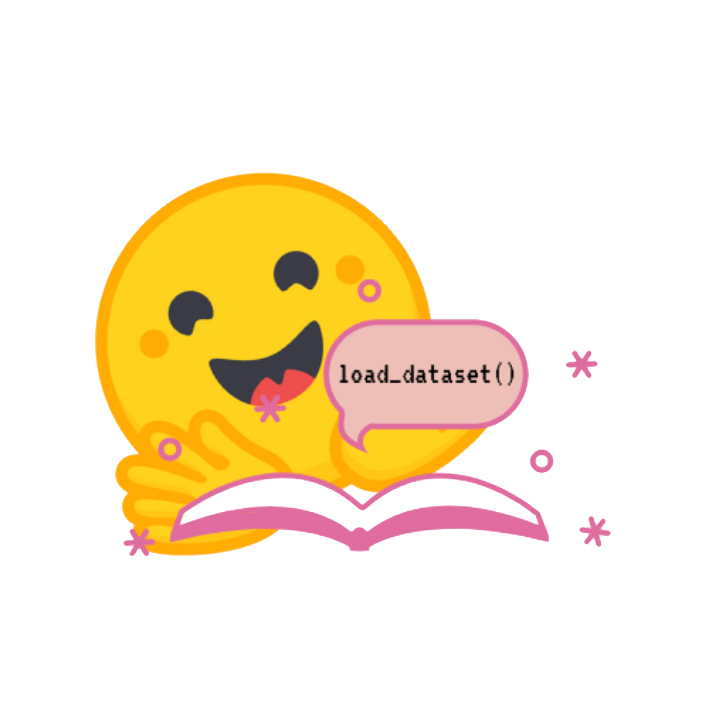
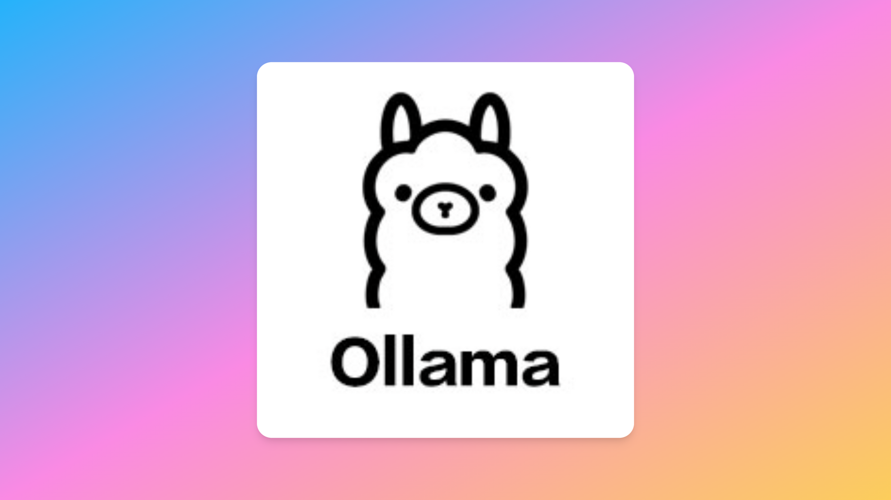

<p align="center">
        
    <h1 align="center">Rick LLM</h1>
    <h3 align="center">Make Llama 3.1 8B talk in Rick Sanchez’s style</h3>
</p>


## Introduction

This project shows you how to make **Llama 3.1 8B** speak like **Rick Sanchez** by:

- Creating a custom dataset from Rick and Morty transcripts in ShareGPT format
- Finetuning the model using [Unsloth](https://unsloth.ai/)'s optimizations on [Lambda Labs](https://lambdalabs.com/) GPUs
- Converting and deploying the model to [Ollama](https://ollama.com/) for local use

It's a fun way to learn LLM finetuning while creating your own Rick-speaking AI assistant.

*Wubba lubba dub dub!*


## Project Design 

<p align="center">
        
</p>

The project can be divided into three main parts:

1. **Dataset creation**: Creating a custom dataset from Rick and Morty transcripts in ShareGPT format.
2. **Model finetuning**: Finetuning the model using Unsloth's optimizations on Lambda Labs GPUs.    
3. **Model deployment**: Converting and deploying the model to Ollama for local use.

Let's begin with the dataset creation.

---

### Dataset Creation

<p align="center">
        
</p>


To train the LLM, we need an instruct dataset. This dataset will contain the instructions for the model to follow. In this case, we want the model to speak like Rick Sanchez, so we'll create a dataset with Rick and Morty transcripts in ShareGPT format. 


<p align="center">
        
</p>

Now that we have the dataset, we can start the finetuning process. We'll use the [Unsloth](https://unsloth.ai/) library to finetune the model. Unsloth is a library that provides a set of optimizations for finetuning LLMs, making the process faster and more efficient.

We are not going to appply a full finetuning, instead, we'll apply a LoRA finetuning. LoRA is a technique that allows us to finetune the model without retraining all the weights. This is a great way to save time and resources, but it's not as accurate as a full finetuning.

Since you might not have access to a local GPU (that's my case, at least), I've designed this process to be fully remote. This means that you'll need to have access to a cloud GPU. I've used [Lambda Labs](https://lambdalabs.com/) for this, but you can use any other cloud provider that supports GPUs.

<p align="center">
        
</p>

> You have all the finetuning code under the [rick_llm](src/rick_llm) folder.

### Model deployment

<p align="center">
        
</p>

Once the model is finetuned, we need to convert it to a format that can be used by Ollama. The two files we need are:

- The model file: `gguf`
- The model file: `Modelfile`


These two files will be located under the `ollama_files` folder.

---


## Configuration

### Environment Variables

Create a `.env` file in the project root with the following variables:

```bash
OPENAI_API_KEY="PUT_YOUR_OPENAI_API_KEY_HERE"
HUGGINGFACE_TOKEN="PUT_YOUR_HUGGINGFACE_TOKEN_HERE"
LAMBDA_API_KEY="PUT_YOUR_LAMBDA_API_KEY_HERE"
```

You can use the `.env.example` file as a template. Simply copy it to `.env` and fill in the values.

The variables are needed for the following:

- **OPENAI_API_KEY**: To use the OpenAI API to [clean](src/dataset.py) the dataset.
- **HUGGINGFACE_TOKEN**: To use the Hugging Face API to push the dataset to Hugging Face.
- **LAMBDA_API_KEY**: To use the Lambda Labs API to sync the local filesystem with the remote one.
